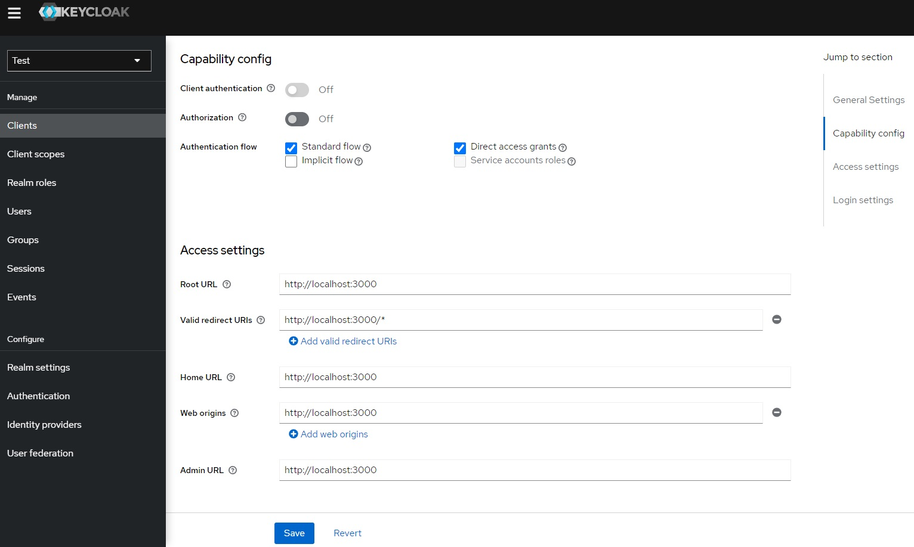
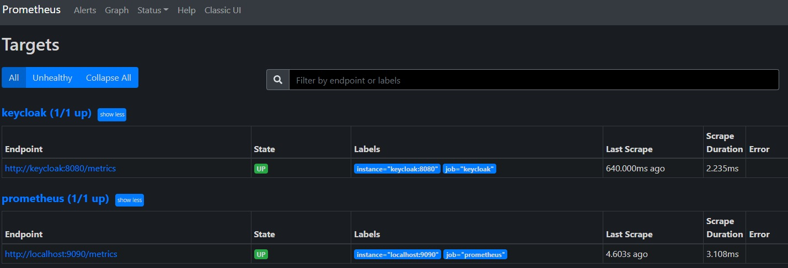

## Wait for the https://github.com/keycloak/keycloak/issues/10216 to be fixed

1. Install [Docker](https://docs.docker.com/engine/install/) and use [v2.3.0](https://github.com/docker/compose/releases/tag/v2.3.0) of the [Compose](https://docs.docker.com/compose/cli-command/)
2. Up the project using command `docker compose up -d --wait`
3. Import realm by command `docker compose exec keycloak /bin/sh -c '/opt/keycloak/bin/kc.sh import --file /tmp/realm.json'`
4. Restart keycloak `docker compose restart keycloak`

## Links and images

| App | Url | Username | Password 
|-|-|-|-
| Keycloak | [http://localhost:8080](http://localhost:8080) | `admin` | `keycloak`

| App | Url 
|-|-
| Prometheus | [http://localhost:8090](http://localhost:8090)

| App | Url | Username | Password 
|-|-|-|-
| Grafana | [http://localhost:3000](http://localhost:3000) | `admin` | `grafana`

## Usefull commands

| Command | Discription
|-|-
| `docker stats --no-stream` | Containers resource usage
| `docker compose logs` | Shows logs of containers (use flag `-f` to follow logs)
| `docker compose down` | Stop and remove containers (flag `-v` remove named volumes declared in the volumes section of the Compose file and anonymous volumes attached to containers)
| `docker system prune -a -f` | Remove all unused containers, networks, images (flag `--volumes` prune volumes)
